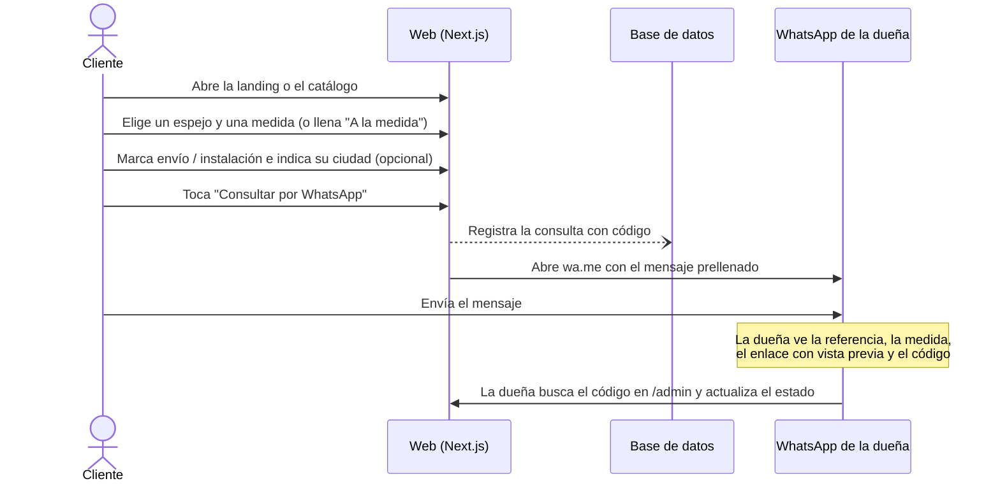

# PRD — Catálogo de espejos con consultas por WhatsApp

> **Versión:** 0.2 (borrador) · **Fecha:** 2026-10-02
> **Proyecto:** `lauravidrio` · **Mercado:** Colombia (COP) · **Nombre comercial:** configurable desde el admin

---

## 1. Resumen

Sitio web para un negocio de espejos en **Colombia**, de todo tipo de formas, estilos y medidas, con **fabricación a la medida**, **envíos** e **instalación**. El cliente recorre el catálogo, elige un modelo y una medida (o diseña uno a la medida) y con un toque envía una consulta al WhatsApp de la dueña. El mensaje lleva la **referencia**, la **medida**, los **servicios** que necesita y un **enlace al producto** para que ella lo vea al instante.

**No hay compra en línea.** La web sirve de vitrina y la venta se cierra por WhatsApp.

El proyecto tiene tres partes:

1. **Landing page**: presentación del negocio con animaciones, enfocada en llevar al cliente al catálogo, al formulario a la medida o a WhatsApp.
2. **Catálogo público**: listado con filtros, página de detalle por producto y página "A la medida".
3. **Panel de gestión** (`/admin`): productos, categorías, imágenes, configuración del negocio y seguimiento de las consultas recibidas.

---

## 1.1 Decisiones del negocio (confirmadas)

| Tema | Decisión | Impacto en el producto |
|------|----------|------------------------|
| País | **Colombia** | Interfaz en `es-CO`, indicativo `+57`, marco legal colombiano (ver sección 7) |
| Moneda | **Pesos colombianos (COP)**, sin decimales | Precios como enteros en la BD. Formato `$ 850.000` con `Intl.NumberFormat('es-CO', { style: 'currency', currency: 'COP', maximumFractionDigits: 0 })` |
| Nombre comercial | **Configurable** desde el admin | Header, footer, metadatos SEO, imágenes OG y mensaje de WhatsApp leen el nombre de `SiteSettings`. El código no tiene ningún nombre fijo |
| Dominio | **Se define después** | Se lanza con el subdominio de Vercel. Al conectar el dominio propio, redirección 308 desde el subdominio para que los enlaces ya enviados por WhatsApp sigan funcionando |
| Envíos e instalación | **Se ofrecen ambos** | Sección de servicios en la landing. El cliente marca "Necesito envío" y/o "Necesito instalación" e indica su ciudad, y eso va en el mensaje |
| A la medida | **Sí se fabrican** | Página `/a-la-medida` con formulario guiado, y opción "Otra medida" en cada producto |
| WhatsApp | **Un solo número**, configurable desde el admin | Validación de formato colombiano: `57` + 10 dígitos de celular (ej. `573001234567`) |

---

## 2. Problema y objetivos

**Problema (supuesto):** la dueña comparte fotos sueltas por WhatsApp o Instagram. Los clientes preguntan "¿cuánto cuesta el de la foto?" sin una referencia clara, y no queda registro de qué productos generan interés ni de cuántas consultas terminan en venta.

| #  | Objetivo | Métrica de éxito |
|----|----------|------------------|
| O1 | Que el cliente llegue a WhatsApp con un producto identificado | El 100 % de los mensajes enviados desde la web incluye referencia, medida y enlace |
| O2 | Acceso rápido e intuitivo | Máximo 2 toques desde la landing hasta WhatsApp; LCP < 2.5 s en móvil 4G |
| O3 | Control del negocio | Cada consulta queda registrada con un código y un estado (nueva → vendida/perdida) |
| O4 | Autonomía de la dueña | Publicar un producto nuevo con fotos en menos de 3 minutos, sin ayuda técnica |
| O5 | Datos separados | El desarrollo nunca toca datos de producción (BD local frente a Neon) |

---

## 3. Usuarios

| Usuario | Contexto | Necesita |
|---------|----------|----------|
| **Cliente final** | Llega sobre todo desde el móvil (Instagram, WhatsApp, Google) | Ver modelos, medidas y precios rápido; preguntar sin registrarse |
| **Dueña** (rol `OWNER`) | Gestiona desde el móvil y a veces desde la PC | Cargar productos fácil, saber qué le consultan, dar seguimiento |
| **Asistente** (rol `EDITOR`, opcional) | Ayuda a cargar catálogo y responder | Editar productos y consultas, sin acceso a configuración ni usuarios |

> El panel de gestión **también debe funcionar bien en el móvil**.

---

## 4. Alcance

### Dentro del MVP
- Landing con animaciones, categorías, destacados, servicios (envío e instalación) y CTA a WhatsApp.
- Catálogo con filtros, búsqueda y detalle con selector de medida.
- Página "A la medida" con formulario guiado que termina en WhatsApp.
- Consulta por WhatsApp (`wa.me`) con mensaje prellenado (producto, medida, servicios y ciudad) y registro de la consulta.
- Política de tratamiento de datos personales (Ley 1581 de 2012).
- Admin: login, productos (variantes de medida e imágenes), categorías, consultas, dashboard básico y configuración.
- Entornos separados: PostgreSQL local para desarrollo y Neon para producción.

### Fuera de alcance
- Carrito con pago, checkout o pasarelas de pago.
- Cuentas o registro de clientes.
- WhatsApp Business API (bots, mensajes automáticos). Se usa solo el enlace `wa.me`.
- Inventario contable, facturación o cotizaciones en PDF.
- Varios idiomas (solo español).

---

## 5. Flujo principal



**Ejemplo de mensaje: producto del catálogo**

```text
Hola, vi este espejo en la web y me interesa:

Espejo Redondo Luna LED
Ref: ESP-0012-60x60
Medida: Ø 60 cm
Precio: $ 850.000
https://<dominio>/espejos/luna-led?medida=60x60

Necesito: envío e instalación
Ciudad: Medellín

Código de consulta: #K7M2QX
¿Está disponible?
```

**Ejemplo de mensaje: a la medida**

```text
Hola, quiero cotizar un espejo a la medida:

Forma: Rectangular
Medida: 120 × 180 cm
Marco: Aluminio negro
Luz LED: Sí
Cantidad: 1
Notas: Para pared de baño, esquinas redondeadas

Necesito: instalación
Ciudad: Bogotá

Código de consulta: #P4W9TZ
```

> `<dominio>` sale de `NEXT_PUBLIC_SITE_URL`: subdominio de Vercel mientras no haya dominio propio. El prefijo de referencia (`ESP`) se configura en el admin.

---

## 6. Requisitos funcionales

Prioridad: **P0** = MVP · **P1** = poco después del lanzamiento · **P2** = futuro.

### 6.1 Landing (`/`)

| ID | Requisito | Prioridad |
|----|-----------|-----------|
| RF-L01 | Hero con imagen o video de un espejo, titular, subtítulo y dos CTA: "Ver catálogo" y "Escríbenos por WhatsApp" | P0 |
| RF-L02 | Categorías con imagen (ej. Baño, Cuerpo entero, Con luz LED, Decorativos, A la medida) | P0 |
| RF-L03 | Productos destacados (marcados en el admin) con botón directo a WhatsApp | P0 |
| RF-L04 | "Cómo funciona" en 3 pasos: Elige → Consulta por WhatsApp → Te lo enviamos e instalamos | P0 |
| RF-L05 | Sección "Espejos a la medida" con CTA a `/a-la-medida` | P0 |
| RF-L06 | Botón flotante de WhatsApp en todo el sitio (consulta general) | P0 |
| RF-L07 | Footer con nombre del negocio (configurable), ubicación, horario, redes, WhatsApp y enlace a la política de datos | P0 |
| RF-L08 | Sección "Servicios": envío e instalación, con cobertura (ciudades o zonas) editable desde el admin | P0 |
| RF-L09 | Galería de proyectos o instalaciones reales | P1 |
| RF-L10 | Testimonios | P1 |
| RF-L11 | Preguntas frecuentes (envío, instalación, tiempos de fabricación, medidas, garantía) | P1 |
| RF-L12 | Página `/politica-de-datos` (Ley 1581 de 2012), con su texto editable desde el admin | P0 |

**Animaciones de la landing:**
- **Hero:** brillo de reflejo que cruza el espejo, parallax suave y entrada escalonada del titular.
- **Scroll:** cada sección aparece con fade y slide-up (300–600 ms) al entrar en pantalla.
- **Tarjetas:** al pasar el cursor cambia a la segunda foto, con un brillo diagonal y una leve elevación.
- **Filtros del catálogo:** las tarjetas se reacomodan con animación de layout al filtrar.
- **Contadores:** cifras que suben al aparecer (ej. "+500 espejos instalados").
- **Botón de WhatsApp:** pulso sutil cada pocos segundos.
- **Reglas:** animar solo `transform` y `opacity`; respetar `prefers-reduced-motion`; ninguna animación bloquea la interacción ni retrasa el contenido principal.

### 6.2 Catálogo (`/espejos`)

| ID | Requisito | Prioridad |
|----|-----------|-----------|
| RF-C01 | Grid responsivo (2 columnas en móvil, 3–4 en desktop): foto, nombre, referencia, rango de medidas y precio "desde" (si se muestra) | P0 |
| RF-C02 | Filtros: categoría, forma, rango de ancho y alto, marco o estilo, con LED, disponibilidad y precio (si es visible) | P0 |
| RF-C03 | Búsqueda por nombre o referencia (ej. `ESP-0012`) | P0 |
| RF-C04 | Filtros y búsqueda sincronizados con la URL (se pueden compartir y el botón "atrás" funciona) | P0 |
| RF-C05 | Paginación con "Cargar más" | P0 |
| RF-C06 | Orden: destacados, recientes, precio ↑↓, tamaño | P1 |
| RF-C07 | Páginas por categoría con URL propia para SEO (`/espejos/categoria/[slug]`) | P1 |
| RF-C08 | Vista rápida en modal desde la tarjeta | P2 |

### 6.3 Detalle de producto (`/espejos/[slug]`)

| ID | Requisito | Prioridad |
|----|-----------|-----------|
| RF-D01 | Galería con deslizamiento, zoom y miniaturas | P0 |
| RF-D02 | Selector de medida (variantes) que actualiza precio, disponibilidad y URL (`?medida=60x80`) | P0 |
| RF-D03 | Ficha: referencia, forma, medidas, marco o material, color, LED, descripción y disponibilidad (*Disponible / Bajo pedido / Agotado*) | P0 |
| RF-D04 | Botón "Consultar por WhatsApp", fijo abajo en móvil | P0 |
| RF-D05 | "Otra medida" (activa por defecto, se puede desactivar por producto): ancho × alto en cm dentro de los límites configurados, que se incluye en el mensaje | P0 |
| RF-D06 | Imagen Open Graph por producto, para que el enlace en WhatsApp muestre foto, nombre y referencia | P0 |
| RF-D07 | Un producto archivado muestra "Este modelo ya no está disponible" con productos similares, no un 404 (los enlaces viejos siguen en los chats) | P0 |
| RF-D08 | Casillas "Necesito envío" y "Necesito instalación" y campo opcional de ciudad (con autocompletado de ciudades de Colombia), todo incluido en el mensaje | P0 |
| RF-D09 | Productos relacionados (misma categoría o forma) | P1 |
| RF-D10 | Botón compartir (Web Share API, con copiar enlace como alternativa) | P1 |

### 6.3.1 Espejos a la medida (`/a-la-medida`)

| ID | Requisito | Prioridad |
|----|-----------|-----------|
| RF-M01 | Formulario guiado de pocos pasos: forma → medidas (ancho × alto o diámetro) → marco y acabado → LED (sí/no) → cantidad → notas | P0 |
| RF-M02 | Vista previa visual de la forma y la proporción elegidas, que se actualiza en vivo (SVG animado) | P1 |
| RF-M03 | Validación de medidas contra el mínimo y el máximo configurados en el admin, con mensaje claro si se pasa | P0 |
| RF-M04 | Casillas de envío e instalación y ciudad, igual que en RF-D08 | P0 |
| RF-M05 | El formulario termina en "Enviar por WhatsApp" con el mensaje a la medida, y la consulta se registra con el tipo `CUSTOM` | P0 |
| RF-M06 | Galería "Trabajos a la medida" de referencia, alimentada desde el admin | P1 |
| RF-M07 | El cliente puede adjuntar foto o plano del espacio. *No es posible con `wa.me`*: el formulario le recuerda enviarla en el chat | — |

### 6.4 Consulta por WhatsApp

| ID | Requisito | Prioridad |
|----|-----------|-----------|
| RF-W01 | Enlace `https://wa.me/<número>?text=<mensaje>`. Número único leído de `SiteSettings` (`57` + 10 dígitos, sin `+`, espacios ni guiones) y texto con `encodeURIComponent` | P0 |
| RF-W02 | El mensaje incluye nombre, referencia de la variante, medida (o la medida personalizada), precio en COP (si es visible), servicios (envío o instalación), ciudad, enlace y código de consulta | P0 |
| RF-W03 | Cada clic registra una **Consulta** en la BD **sin bloquear ni retrasar** la apertura de WhatsApp | P0 |
| RF-W04 | Rate limit por IP en el registro de consultas (anti-spam) | P0 |
| RF-W05 | **"Mi selección"**: el cliente agrega varios espejos (guardados en el navegador) y los envía en un solo mensaje (máximo 10) | P1 |
| RF-W06 | Plantilla del mensaje editable desde el admin, con variables (`{productos}`, `{codigo}`…) | P1 |

**Implementación recomendada para RF-W03:** el código de consulta (ej. `K7M2QX`) se genera en el cliente y el botón es un `<a href="https://wa.me/...">` real. Al hacer clic se envía el registro con `navigator.sendBeacon` a `/api/inquiries`. Así WhatsApp abre al instante, aunque falle la red o la BD, y se evita que Safari en iOS bloquee la ventana (lo que pasa si se abre después de un `await`).

### 6.5 Panel de gestión (`/admin`)

| ID | Requisito | Prioridad |
|----|-----------|-----------|
| **Acceso** | | |
| RF-A01 | Login con email y contraseña. Sin registro público: los usuarios los crea la dueña o un script | P0 |
| RF-A02 | Roles `OWNER` y `EDITOR` | P1 |
| **Dashboard** | | |
| RF-A03 | KPIs: consultas de hoy, 7 y 30 días; consultas por estado; top 5 productos más consultados; tasa de cierre (vendidas / total) | P0 |
| RF-A04 | Alertas de calidad: productos publicados sin foto o sin medidas, y borradores pendientes | P1 |
| **Productos** | | |
| RF-A05 | Tabla con búsqueda, filtros (categoría, estado) y orden. Acciones rápidas: publicar o despublicar, destacar, duplicar y archivar | P0 |
| RF-A06 | Formulario para crear y editar: datos, categoría, atributos y variantes de medida (agregar y quitar filas con precio y disponibilidad) | P0 |
| RF-A07 | Subida de varias imágenes arrastrando y soltando, con reordenamiento y texto alternativo. La primera es la portada | P0 |
| RF-A08 | Referencia autogenerada y consecutiva con el prefijo configurado (`ESP-0001`), editable | P0 |
| RF-A09 | Vista previa antes de publicar | P1 |
| RF-A10 | "Copiar enlace" y "Enviar por WhatsApp" para que la dueña comparta un producto con un cliente | P1 |
| **Categorías** | | |
| RF-A11 | Crear, editar y eliminar categorías, con imagen y orden manual | P0 |
| **Consultas** | | |
| RF-A12 | Lista con código, fecha, tipo (catálogo o a la medida), productos, medida, servicios, ciudad y estado. Filtros por estado, tipo, fecha, ciudad y producto | P0 |
| RF-A13 | Búsqueda por código (el que llega en el mensaje de WhatsApp) | P0 |
| RF-A14 | Cambio de estado (*Nueva → Contactada → Cotizada → Vendida / Perdida*), nombre y teléfono del cliente, y notas | P0 |
| RF-A15 | Exportar a CSV | P2 |
| **Configuración** | | |
| RF-A16 | Nombre del negocio, logo, número de WhatsApp (con botón "Probar enlace"), prefijo de referencias, redes, dirección y horario | P0 |
| RF-A16b | Servicios: textos de envío e instalación, ciudades o zonas de cobertura, y medidas mínima y máxima para "a la medida" | P0 |
| RF-A16c | Texto de la política de tratamiento de datos | P0 |
| RF-A17 | Plantilla del mensaje de WhatsApp (ver RF-W06) | P1 |
| RF-A18 | Gestión de usuarios (solo `OWNER`) | P1 |
| RF-A19 | Textos de la landing (hero, FAQ) editables | P2 |

---

## 7. Requisitos no funcionales

| Área | Requisito |
|------|-----------|
| **Rendimiento** | Lighthouse móvil ≥ 90. LCP < 2.5 s, CLS < 0.1 e INP < 200 ms. Las páginas públicas van cacheadas (estáticas o ISR) y se invalidan bajo demanda cuando el admin guarda cambios, así el visitante casi nunca espera a la BD. La imagen del hero se precarga y las secciones bajo el pliegue se cargan en diferido |
| **Imágenes** | Servidas en AVIF o WebP con tamaños responsivos. Proporción fija en las tarjetas (ej. 4:5) para evitar saltos de layout |
| **SEO** | Metadata por página, `sitemap.xml`, `robots.txt`, URL canónica (la variante apunta al producto base), JSON-LD `Product` (con `offers` solo si hay precio visible) y `LocalBusiness` en la landing |
| **Accesibilidad** | WCAG 2.2 AA: contraste, foco visible, navegación con teclado, `alt` en todas las imágenes (por defecto el nombre del producto) y `prefers-reduced-motion` |
| **Seguridad** | `/admin` protegido en dos capas: chequeo rápido en `proxy.ts` y verificación real de sesión en cada layout o Server Action. Validación con Zod en el servidor, rate limit en login y en consultas, y secretos solo en variables de entorno |
| **Datos** | Backups y restauración point-in-time de Neon (según el plan). Las consultas guardan un *snapshot* del nombre, la referencia y el precio, para que el historial no cambie si se edita el producto |
| **Analítica** | Eventos `whatsapp_click`, `custom_quote_click`, `filter_used` y `product_view` con una herramienta respetuosa de la privacidad (Vercel Analytics o Umami). Las visitas no se guardan en la BD |
| **Localización** | `lang="es-CO"`, `og:locale` `es_CO`, precios en COP sin decimales (`$ 850.000`), medidas en centímetros, fechas en zona `America/Bogota` |
| **Legal (Colombia)** | Política de tratamiento de datos personales según la Ley 1581 de 2012 (se guardan nombre, teléfono y ciudad del cliente que registra la dueña). Precios visibles con IVA incluido (Estatuto del Consumidor, Ley 1480 de 2011). Validar los textos con un asesor legal antes del lanzamiento |

---

## 8. Stack recomendado

| Capa | Elección | Por qué |
|------|----------|---------|
| Framework | **Next.js 16+ (App Router) + React 19 + TypeScript** | Un solo proyecto para landing, catálogo y admin. SSG/ISR para velocidad y SEO; Server Components y Server Actions para el admin sin una API aparte |
| Estilos y UI | **Tailwind CSS v4 + shadcn/ui** | Componentes accesibles (formularios, tablas, diálogos, sheets) que son tuyos y se personalizan; ideal para el admin |
| Animaciones | **Motion** (antes Framer Motion) + **Lenis** (scroll suave) | Animaciones al hacer scroll, layout animado en filtros y gestos en la galería. `LazyMotion` reduce el peso. GSAP solo si luego se quiere *scroll-telling* complejo |
| ORM | **Prisma 7** | Esquema tipado, migraciones versionadas y el mismo código contra la BD local y Neon |
| BD local | **PostgreSQL 18 nativo** (instalado con scoop; misma versión mayor que Neon) | Paridad total con producción (ver nota abajo) |
| BD producción | **Neon** (Postgres serverless) | Gratis al inicio, backups, ramas para previews y *scale-to-zero* |
| Driver | `@prisma/adapter-pg` en ambos entornos | Un solo camino de código. Neon acepta conexiones TCP estándar mediante su pooler |
| Autenticación | **Better Auth** (adaptador Prisma) | Email y contraseña, sesiones en BD, `disableSignUp`, rate limit integrado y roles |
| Imágenes | **Cloudinary** (`next-cloudinary`) | Subida firmada desde el admin, recorte y optimización automática (`f_auto,q_auto`) y CDN. Las imágenes no ocupan espacio en Neon |
| Formularios | **React Hook Form + Zod** | El mismo esquema valida en el cliente y en el servidor |
| Tablas del admin | Tabla de shadcn con filtros y paginación **en el servidor** (en la URL) | Suficiente para el tamaño del catálogo; TanStack Table solo si hiciera falta ordenar o filtrar en el cliente |
| Estado en la URL | **nuqs** | Filtros del catálogo sincronizados con la URL |
| Gráficas | **Recharts** (charts de shadcn) | Dashboard de consultas |
| Hosting | **Vercel** | Integración nativa con Next.js e integración con Neon para ramas de preview. Funciones en `iad1` y Neon en `us-east-1` (misma región, buena latencia hacia Colombia) |
| Calidad | ESLint + Prettier, **Vitest** (unidad, en CI) y **Playwright** (flujo de WhatsApp de punta a punta) | |
| Paquetes | **pnpm** | |

> **¿Por qué no SQLite en local?** Un esquema de Prisma tiene **un solo `provider`**. Usar SQLite en local y Postgres en producción obliga a mantener dos esquemas y dos historiales de migraciones, y además los enums, `Decimal`, la búsqueda por texto y el manejo de mayúsculas y tildes se comportan distinto. Con Postgres en local, lo que funciona en tu PC funciona en Neon. *Alternativas:* Postgres en Docker o una rama `dev` de Neon (sigue separada de producción, pero requiere internet).

---

## 9. Arquitectura y entornos

### 9.1 Entornos

| Entorno | Base de datos | Datos | Migraciones |
|---------|---------------|-------|-------------|
| **Local** | PostgreSQL 18 nativo (`localhost:5432`) | Seed de prueba | `prisma migrate dev` (crea migraciones) |
| **Preview** (PR en Vercel) | Rama de Neon por preview (integración Vercel ↔ Neon) | Copia de producción o vacía | `prisma migrate deploy` |
| **Producción** | Neon, rama `main` | Reales | `prisma migrate deploy` (solo aplica migraciones) |

### 9.2 Reglas para mantener los datos separados
1. El `.env` local **nunca** contiene la URL de Neon de producción. Las variables de producción viven solo en Vercel.
2. `prisma migrate dev` y `prisma migrate reset` **solo** en local. En Neon solo se ejecuta `prisma migrate deploy`.
3. El script de seed **aborta** si el host de `DATABASE_URL` no es `localhost`, si `NODE_ENV=production`, si corre en Vercel o si existe `DATABASE_URL_UNPOOLED`.
4. El primer usuario admin de producción se crea con un script dedicado (`pnpm admin:create`), no con el seed.
5. Las previews nunca apuntan a la rama `main` de Neon.
6. Todo cambio de esquema pasa por una migración versionada en git. Nada de `db push` contra Neon.

### 9.3 Variables de entorno

```bash
# Base de datos
DATABASE_URL=            # runtime. Local: postgresql://postgres@localhost:5432/lauravidrio · Prod: Neon con pooler (-pooler)
DATABASE_URL_UNPOOLED=   # migraciones (prisma.config.ts). Local: no se define · Prod/Preview: la crea la integración Vercel ↔ Neon

# Auth
BETTER_AUTH_SECRET=
BETTER_AUTH_URL=

# Sitio
NEXT_PUBLIC_SITE_URL=   # hoy: https://<proyecto>.vercel.app · luego: dominio propio
CANONICAL_HOST=         # al tener dominio, proxy.ts redirige (308) cualquier otro host a este

# Cloudinary
NEXT_PUBLIC_CLOUDINARY_CLOUD_NAME=
CLOUDINARY_API_KEY=
CLOUDINARY_API_SECRET=
```

> El nombre del negocio, el número de WhatsApp, el prefijo de referencias y los textos de servicios viven en la BD (`SiteSettings`), así la dueña los cambia sin un nuevo deploy.

### 9.4 Scripts (`package.json`)

```json
{
  "postinstall": "prisma generate",
  "db:start": "node scripts/db.mjs start",
  "db:stop": "node scripts/db.mjs stop",
  "db:migrate": "prisma migrate dev",
  "db:deploy": "prisma migrate deploy",
  "db:seed": "prisma db seed",
  "db:studio": "prisma studio",
  "admin:create": "tsx scripts/create-admin.ts"
}
```

En Vercel, `vercel.json` define el build command `pnpm db:deploy && pnpm build`: Production y Preview aplican sus migraciones, cada uno con su propia `DATABASE_URL_UNPOOLED`.

### 9.5 Estructura de carpetas

```text
lauravidrio/
├─ vercel.json                   # build command con migraciones
├─ prisma.config.ts              # datasource para el CLI (DATABASE_URL_UNPOOLED ?? DATABASE_URL)
├─ prisma/
│  ├─ schema.prisma
│  ├─ migrations/
│  └─ seed.ts                    # solo local
├─ scripts/
│  ├─ db.mjs                     # arranca o detiene el Postgres local
│  └─ create-admin.ts            # Sprint 1
└─ src/
   ├─ app/
   │  ├─ (public)/
   │  │  ├─ page.tsx                     # landing
   │  │  ├─ a-la-medida/page.tsx         # formulario guiado
   │  │  ├─ politica-de-datos/page.tsx
   │  │  └─ espejos/
   │  │     ├─ page.tsx                  # catálogo
   │  │     └─ [slug]/
   │  │        ├─ page.tsx               # detalle
   │  │        └─ opengraph-image.tsx    # vista previa para WhatsApp
   │  ├─ admin/
   │  │  ├─ login/page.tsx
   │  │  ├─ page.tsx                     # dashboard
   │  │  ├─ productos/  categorias/  consultas/  configuracion/
   │  ├─ api/
   │  │  ├─ auth/[...all]/route.ts       # Better Auth
   │  │  └─ inquiries/route.ts           # registro de consultas (sendBeacon)
   │  ├─ sitemap.ts
   │  └─ robots.ts
   ├─ components/  (ui/ · landing/ · catalog/ · admin/)
   ├─ lib/         (prisma.ts · auth.ts · whatsapp.ts · cloudinary.ts · validations/)
   ├─ server/      (queries/ · actions/)
   └─ proxy.ts                           # protección de /admin
```

---

## 10. Modelo de datos (borrador)

```prisma
generator client {
  provider = "prisma-client"
  output   = "../src/generated/prisma"
}

datasource db {
  provider = "postgresql" // la URL se define en prisma.config.ts
}

enum ProductStatus { DRAFT PUBLISHED ARCHIVED }
enum Availability  { IN_STOCK MADE_TO_ORDER OUT_OF_STOCK }
enum MirrorShape   { RECTANGULAR SQUARE ROUND OVAL ARCH ORGANIC OTHER }
enum InquiryStatus { NEW CONTACTED QUOTED WON LOST }
enum InquiryType   { CATALOG CUSTOM GENERAL }         // producto, a la medida, botón flotante
enum Role          { OWNER EDITOR }

model Category {
  id          String    @id @default(cuid())
  name        String
  slug        String    @unique
  description String?
  imageUrl    String?
  position    Int       @default(0)
  isActive    Boolean   @default(true)
  products    Product[]
  createdAt   DateTime  @default(now())
  updatedAt   DateTime  @updatedAt
}

model Product {
  id              String           @id @default(cuid())
  reference       String           @unique              // ESP-0001 (prefijo configurable)
  name            String
  slug            String           @unique
  description     String?
  shape           MirrorShape
  frameMaterial   String?                               // aluminio, madera, sin marco…
  frameColor      String?
  style           String?                               // moderno, vintage, minimalista…
  hasLed          Boolean          @default(false)
  searchText      String                                // nombre + ref sin tildes y en minúsculas (búsqueda)
  isFeatured      Boolean          @default(false)
  showPrice       Boolean          @default(true)
  allowCustomSize Boolean          @default(true)
  status          ProductStatus    @default(DRAFT)
  categoryId      String
  category        Category         @relation(fields: [categoryId], references: [id])
  variants        ProductVariant[]
  images          ProductImage[]
  inquiryItems    InquiryItem[]
  createdAt       DateTime         @default(now())
  updatedAt       DateTime         @updatedAt

  @@index([status, categoryId])
}

model ProductVariant {
  id           String        @id @default(cuid())
  productId    String
  product      Product       @relation(fields: [productId], references: [id], onDelete: Cascade)
  sku          String        @unique                    // ESP-0001-60x80
  widthCm      Int                                      // en redondos: diámetro (width = height)
  heightCm     Int
  price        Int?                                     // COP enteros, IVA incluido
  availability Availability  @default(IN_STOCK)
  isDefault    Boolean       @default(false)
  position     Int           @default(0)
  inquiryItems InquiryItem[]
}

model ProductImage {
  id        String  @id @default(cuid())
  productId String
  product   Product @relation(fields: [productId], references: [id], onDelete: Cascade)
  publicId  String                                      // id en Cloudinary
  url       String
  alt       String?
  width     Int
  height    Int
  position  Int     @default(0)                         // 0 = portada
}

model Inquiry {
  id            String        @id @default(cuid())
  code              String        @unique               // K7M2QX, viaja en el mensaje
  type              InquiryType
  status            InquiryStatus @default(NEW)
  needsShipping     Boolean       @default(false)
  needsInstallation Boolean       @default(false)
  city              String?                             // la indica el cliente
  source            String?                             // landing, catalogo, detalle, utm_*
  customerName      String?                             // lo completa la dueña
  customerPhone     String?
  notes             String?
  items             InquiryItem[]
  createdAt         DateTime      @default(now())
  updatedAt         DateTime      @updatedAt

  @@index([status, createdAt])
  @@index([type, createdAt])
}

model InquiryItem {
  id            String          @id @default(cuid())
  inquiryId     String
  inquiry       Inquiry         @relation(fields: [inquiryId], references: [id], onDelete: Cascade)
  productId     String?
  product       Product?        @relation(fields: [productId], references: [id], onDelete: SetNull)
  variantId     String?
  variant       ProductVariant? @relation(fields: [variantId], references: [id], onDelete: SetNull)
  // snapshot: el historial no cambia si se edita o borra el producto
  reference     String                                  // "A-LA-MEDIDA" si es CUSTOM
  productName   String
  widthCm       Int?
  heightCm      Int?
  isCustomSize  Boolean         @default(false)
  customShape   MirrorShape?                            // solo a la medida
  frameDetails  String?                                 // marco y acabado elegidos
  hasLed        Boolean?
  quantity      Int             @default(1)
  priceSnapshot Int?                                    // COP
  notes         String?                                 // notas del cliente
}

model SiteSettings {
  id                Int      @id @default(1)            // fila única
  businessName      String                              // configurable, se usa en todo el sitio
  logoUrl           String?
  whatsappNumber    String                              // 57 + 10 dígitos, ej. 573001234567
  messageTemplate   String?
  currencyCode      String   @default("COP")
  locale            String   @default("es-CO")
  referencePrefix   String   @default("ESP")
  referenceCounter  Int      @default(0)                // se incrementa en una transacción
  shippingInfo      String?                             // texto de envíos
  installationInfo  String?                             // texto de instalación
  coverageAreas     String[]                            // ciudades o zonas atendidas
  customMinCm       Int      @default(20)               // límites de "a la medida"
  customMaxCm       Int      @default(250)
  customFrameOptions String[]                           // marcos y acabados ofrecidos a la medida
  privacyPolicy     String?                             // Ley 1581 de 2012
  instagramUrl      String?
  facebookUrl       String?
  tiktokUrl         String?
  address           String?
  openingHours      String?
}

// User, Session, Account y Verification: generados por el CLI de Better Auth.
// Se agrega `role Role @default(EDITOR)` al modelo User.
```

---

## 11. Diseño y UX

- **Mobile-first.** La mayoría del tráfico llega desde Instagram y WhatsApp en el móvil.
- **Ruta corta:** Landing → Producto → WhatsApp (2 toques). Las tarjetas destacadas permiten ir directo a WhatsApp (1 toque). Para lo que no está en el catálogo: Landing → A la medida → WhatsApp.
- **Estilo visual:** limpio y luminoso. Fondos neutros (blanco roto, arena, gris cálido), fotos como protagonistas y acentos metálicos sutiles (efecto reflejo o brillo) en hover y en el hero.
- **Tipografía:** una serif elegante para los títulos y una sans legible para el texto, con `next/font` (sin saltos de carga).
- **Fotos:** guía para la dueña con fondo neutro, luz natural, una foto frontal, una de detalle y una ambientada, en proporción fija. Cloudinary recorta automáticamente.
- **Medidas siempre visibles:** "60 × 80 cm" o "Ø 60 cm" en la tarjeta y en el detalle. Es lo primero que pregunta el cliente.
- **Admin:** formularios cortos con valores por defecto, variantes en filas editables, subida de fotos desde la cámara del móvil y confirmación antes de archivar o eliminar.

---

## 12. Criterios de aceptación del flujo principal

1. **Dado** un producto publicado con la variante 60 × 80, **cuando** el cliente toca "Consultar por WhatsApp", **entonces** se abre WhatsApp con un mensaje que contiene el nombre, `ESP-XXXX-60x80`, "60 × 80 cm", el precio en formato `$ 850.000`, el enlace `…/espejos/<slug>?medida=60x80` y un código, **y** en `/admin/consultas` aparece una consulta *Nueva* con ese código.
2. **Dado** que el cliente completa `/a-la-medida` con 120 × 180 cm, marca instalación y escribe "Bogotá", **entonces** el mensaje incluye forma, medida, marco, LED, cantidad, notas, "Necesito: instalación" y "Ciudad: Bogotá", **y** la consulta queda registrada con tipo `CUSTOM`. Una medida fuera de los límites configurados no deja continuar y explica el rango permitido.
3. Al cambiar el nombre del negocio o el número de WhatsApp en el admin, el sitio y los mensajes usan el nuevo valor sin un nuevo deploy.
4. Si el registro de la consulta falla (sin red o con la BD caída), WhatsApp **se abre igual**.
5. Al enviarse el mensaje, WhatsApp muestra la vista previa del enlace con la foto del producto.
6. Funciona en iPhone (Safari), Android (Chrome) y desktop (abre WhatsApp Web o la app de escritorio).
7. Un producto en `DRAFT` no aparece en el catálogo ni en el sitemap. Uno `ARCHIVED` muestra la página "ya no disponible" con productos similares.
8. Un cambio guardado en el admin se refleja en el sitio público en menos de 1 minuto.

---

## 13. Plan de entrega

El plan detallado por sprint y feature está en **[ROADMAP.md](ROADMAP.md)**.

---

## 14. Riesgos y mitigaciones

| Riesgo | Mitigación |
|--------|------------|
| Fotos de baja calidad que hacen ver pobre el catálogo | Guía de fotos, proporción fija y recorte o mejora automática con Cloudinary |
| El plan Hobby de Vercel es solo para uso **no comercial** | Usar Vercel Pro para producción, o un hosting alternativo compatible con Next.js |
| Ejecutar por error una migración o el seed contra producción | Reglas de la sección 9.2, guardas en los scripts y URLs de producción solo en Vercel |
| Spam o bots que inflan las consultas | Rate limit por IP, validación con Zod y descarte de payloads inválidos |
| Arranque en frío de Neon (*scale-to-zero*) | Páginas públicas cacheadas. El registro de consultas va en segundo plano y no afecta al cliente |
| Emojis o caracteres especiales que se ven mal en algunos clientes de WhatsApp | Plantilla por defecto sin emojis, `encodeURIComponent` y pruebas en iOS, Android y Web |
| La vista previa del enlace no aparece | Imagen OG de 1200 × 630 y menos de 300 KB, URL absoluta y metadatos validados |
| Al conectar el dominio propio se rompen los enlaces ya enviados por WhatsApp | Redirección 308 desde el subdominio de Vercel hacia `CANONICAL_HOST` en `proxy.ts`, conservando ruta y parámetros |
| Incumplir la Ley 1581 (datos personales) o mostrar precios sin IVA | Página de política de datos desde el MVP, precios con IVA incluido y revisión legal antes del lanzamiento |
| El cliente quiere enviar fotos del espacio (a la medida) | `wa.me` no permite adjuntos. El formulario le indica que envíe la foto en el chat después del mensaje |

---

## 15. Preguntas abiertas

**Ya resueltas:** país (Colombia), moneda (COP), nombre configurable, dominio después, envíos e instalación sí, a la medida sí, un solo número de WhatsApp configurable. Ver la [sección 1.1](#11-decisiones-del-negocio-confirmadas).

**Pendientes:**
1. **Precios:** ¿se muestran en la web, o todo es "a consultar"? ¿Por producto o global?
2. **Cobertura:** ¿en qué ciudades o zonas se envía e instala? ¿El costo se muestra o se cotiza?
3. **A la medida:** ¿medida mínima y máxima? ¿Qué marcos, acabados y opciones (LED, biselado, antiempañante) se ofrecen?
4. **Tiempos:** ¿cuánto tarda la fabricación a la medida y la entrega?
5. **Volumen inicial:** ¿cuántos productos y categorías aproximadamente?
6. **Fotos:** ¿hay fotos profesionales, o se toman con el móvil?
7. **Usuarios del admin:** ¿solo la dueña, o también asistentes?
8. **Identidad visual:** ¿hay logo, colores o tipografías definidos?
9. **Garantía:** ¿se ofrece garantía? ¿Se muestra en la web?
