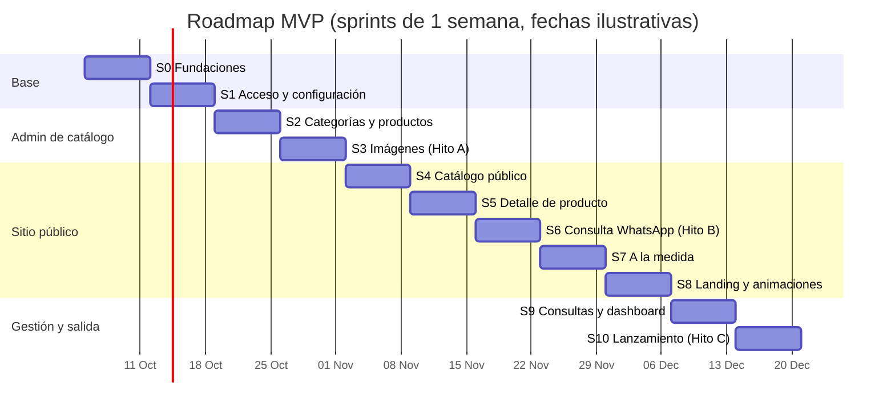

# Roadmap — Catálogo de espejos

> Plan de sprints por feature, derivado del [PRD.md](PRD.md). Los IDs (`RF-…`) remiten a los requisitos del PRD.
> **Duración sugerida:** sprints de 1 semana; si el ritmo real es otro, se ajusta sin cambiar el orden.
> **Última actualización:** 2026-10-02

---

## Resumen

| Sprint | Feature | Resultado | Hito | Estado |
|--------|---------|-----------|------|--------|
| S0 | Fundaciones | Proyecto base, BD local + Neon, deploy y CI | | 🟨 En curso (falta Neon/Vercel/GitHub) |
| S1 | Acceso y configuración del negocio | Login del admin, nombre y WhatsApp configurables | | ✅ Hecho en local (falta probar en producción) |
| S2 | Categorías y productos | CRUD de catálogo con variantes de medida y precios COP | | ✅ Hecho |
| S3 | Imágenes de producto | Subida a Cloudinary, orden y portada | 🏁 **A** | ✅ Hecho (Hito A espera el deploy) |
| S4 | Catálogo público | `/espejos` con filtros, búsqueda y animaciones | | ✅ Hecho (falta Lighthouse sobre el deploy) |
| S5 | Detalle de producto | `/espejos/[slug]` con galería, medidas y servicios | | ✅ Hecho |
| S6 | Consulta por WhatsApp | Mensaje + registro de consulta con código | 🏁 **B** | ⬜ Pendiente |
| S7 | Espejos a la medida | `/a-la-medida` con formulario guiado | | ⬜ Pendiente |
| S8 | Landing y animaciones | Página de inicio completa | | ⬜ Pendiente |
| S9 | Seguimiento de consultas y dashboard | Gestión de consultas y KPIs | | ⬜ Pendiente |
| S10 | Lanzamiento | SEO, rendimiento, QA, legal, go-live | 🏁 **C** | ⬜ Pendiente |
| S11+ | Post-MVP | Mi selección, contenido, admin avanzado | | ⬜ Pendiente |

### Hitos

- 🏁 **A — Catálogo cargable (fin de S3):** el admin ya funciona en producción. **La dueña empieza a cargar sus productos reales** mientras se construye el sitio público; así, al lanzar, el catálogo ya está lleno.
- 🏁 **B — Flujo de venta funcionando (fin de S6):** un cliente puede ver un espejo y escribir por WhatsApp con referencia, medida y enlace. Se puede hacer un *soft launch* compartiendo enlaces de productos por Instagram o WhatsApp.
- 🏁 **C — Lanzamiento público (fin de S10):** landing, a la medida, seguimiento y SEO listos.

---

## Cómo trabajamos

**Flujo de ramas**
1. Una rama por sprint o por tarea: `feat/s04-catalogo`, `fix/s06-encoding-wa`.
2. PR hacia `main` → Vercel crea un **preview** con su propia **rama de Neon** (nunca toca producción).
3. Merge a `main` → deploy a producción con `prisma migrate deploy`.

**Definición de terminado (aplica a todas las tareas)**
- [ ] `lint`, `typecheck` y `build` pasan en CI.
- [ ] Si cambió el esquema, la migración está incluida y probada en local.
- [ ] Probado en móvil (375 px) y desktop; sin errores en consola.
- [ ] Validación con Zod en el servidor para toda entrada de datos.
- [ ] Revisado en el preview de Vercel.
- [ ] Si cambió el alcance, se actualizó el PRD.

**Ceremonias mínimas**
- **Inicio de sprint:** confirmar el alcance y mover a "Post-MVP" lo que no quepa.
- **Fin de sprint:** demo corta **con la dueña** (ella es la usuaria del admin) y actualizar el estado en este archivo.

---

## S0 — Fundaciones

**Objetivo:** proyecto base funcionando en local y en producción, con los datos separados desde el día uno.
**Depende de:** —

**Tareas**
- [x] Inicializar repo git y proyecto Next.js 16.3 (App Router, TypeScript, `src/`, pnpm, Cache Components).
- [x] Tailwind CSS v4 + shadcn/ui (base-nova). Tokens de diseño: neutros cálidos, Manrope + Cormorant Garamond con `next/font`.
- [x] ESLint + Prettier (con plugin de Tailwind). Scripts `lint`, `typecheck`, `format` y `format:check`.
- [x] PostgreSQL 18 nativo (scoop) en lugar de Docker, con `pnpm db:start`, `db:stop` y `db:status`.
- [x] Prisma 7.10: `schema.prisma` (modelo del PRD §10), `prisma.config.ts` y `lib/prisma.ts` (singleton con `@prisma/adapter-pg`).
- [x] Primera migración (`init`).
- [x] `prisma/seed.ts` con 5 categorías, 13 productos (1 borrador y 1 archivado), 23 variantes y 3 consultas de ejemplo. **Solo corre contra localhost.**
- [x] `.env.example` documentado; `.env` en `.gitignore`.
- [ ] Repositorio privado en GitHub y primer push.
- [ ] Neon: proyecto en `us-east-1` (Postgres 18), rama `main`.
- [x] Vercel: `vercel.json` con build command `pnpm db:deploy && pnpm build` y región `iad1`.
- [ ] Vercel: crear el proyecto, conectarlo al repo y a Neon.
- [ ] Integración Vercel ↔ Neon para crear una rama de BD por preview.
- [x] GitHub Actions: `prisma validate`, migraciones + seed contra Postgres 18, formato, `lint`, `typecheck` y `build`.
- [x] Página provisional que lee la BD, más `/api/health` para verificar despliegues.

**Demo / terminado cuando**
- [x] `pnpm db:start && pnpm db:migrate && pnpm db:seed && pnpm dev` levanta todo en local.
- [ ] Un push a `main` despliega en `*.vercel.app` conectado a Neon (`/api/health` responde `ok`).
- [ ] Un PR genera un preview con su propia rama de Neon.

---

## S1 — Acceso y configuración del negocio

**Objetivo:** la dueña entra al admin y configura el nombre, el WhatsApp y los datos del negocio.
**Requisitos:** RF-A01, RF-A16, RF-A16b, RF-A16c
**Depende de:** S0

**Tareas**
- [x] Better Auth 1.7 con adaptador Prisma: email y contraseña, `disableSignUp`, rate limit en BD (5 intentos por minuto). Migración `auth` con las tablas y `role`.
- [x] `pnpm admin:create` crea o actualiza usuarios (local, o producción con `--env-file`). El seed crea `admin@local.test` y `editor@local.test` solo en local.
- [x] `/admin/login` con validación, mensaje de error y regreso a la página pedida (`?next=`).
- [x] `proxy.ts` hace el chequeo optimista de `/admin/*`. `requireAdmin()` (páginas) y `authorizeAction()` (Server Actions, 401/403) en `src/lib/dal.ts`.
- [x] Layout del admin: sidebar colapsable en desktop, drawer en móvil, menú de usuario con cerrar sesión. Secciones futuras marcadas "Pronto".
- [x] `/admin/configuracion` por secciones (solo rol `OWNER`; `EDITOR` ve "Sin acceso"):
  - [x] **Negocio:** nombre, dirección, horario y redes. La subida del logo pasa a S3.
  - [x] **WhatsApp:** acepta `300 123 4567`, `+57…` o `57…`, lo normaliza en vivo y tiene botón "Probar".
  - [x] **Referencias:** prefijo (por defecto `ESP`).
  - [x] **Servicios:** textos de envío e instalación y ciudades de cobertura (una por línea).
  - [x] **A la medida:** medida mínima y máxima (validadas) y marcos y acabados.
  - [x] **Legal:** texto de la política de tratamiento de datos.
- [x] `getSettings()` con `"use cache"` + `cacheTag("settings")`, invalidado con `updateTag` al guardar.
- [x] Header y footer públicos provisionales con nombre, WhatsApp, horario y redes.

**Demo / terminado cuando**
- [ ] La dueña inicia sesión **en producción**, cambia el nombre y el número, y el sitio muestra el cambio en menos de 1 minuto. *(Probado en local: el cambio es inmediato. Falta el deploy de S0.)*
- [x] Una ruta `/admin/*` sin sesión redirige al login. Las Server Actions verifican la sesión con `authorizeAction()` y responden 401/403.

---

## S2 — Categorías y productos

**Objetivo:** crear y editar productos con varias medidas y precios en COP.
**Requisitos:** RF-A05, RF-A06, RF-A08, RF-A11
**Depende de:** S1

**Tareas**
- [x] **Categorías:** orden con botones subir/bajar (en vez de arrastrar: funciona igual en el móvil y con teclado); crear y editar en un diálogo; ocultar; eliminar con confirmación (bloqueado si tiene productos); slug automático.
- [x] **Listado de productos:** búsqueda (sin importar tildes), filtro por categoría, pestañas por estado con contadores y paginación de 20, todo en la URL. Tabla en desktop y tarjetas en móvil. *Filtrado en el servidor, sin TanStack Table: no hizo falta.*
- [x] **Formulario de producto** (React Hook Form + Zod compartido): nombre, categoría, forma (chips), descripción, marco con sugerencias, color, estilo, LED, "mostrar precios", "aceptar otra medida", estado, destacado, referencia y enlace. Avisa de cambios sin guardar.
- [x] **Variantes en filas editables:** ancho y alto (diámetro en redondos, lado en cuadrados), precio con máscara `850.000`, disponibilidad y estrella de medida principal. Detecta medidas repetidas.
- [x] Referencia automática `PREFIJO-0001` con contador transaccional (sin choques entre altas simultáneas); SKU `REF-60x80`. Al editar se conservan los ids de las variantes, aunque se intercambien medidas.
- [x] Slug automático, único y editable. `searchText` normalizado.
- [x] Acciones rápidas: publicar o pasar a borrador, destacar, duplicar (como borrador con nueva referencia), archivar (con confirmación) y restaurar.
- [x] Regla: no se publica sin al menos una medida (formulario y acción rápida).
- [x] Vitest: 48 tests (formatos COP y medidas, WhatsApp, slugs, validaciones de producto y configuración, y `authorizeAction` 401/403). Corren en CI.

**Demo / terminado cuando**
- [x] Se crea un producto con 3 medidas y precios (probado en el navegador; la vista móvil no tiene scroll horizontal).
- [x] Duplicar un producto genera una nueva referencia consecutiva (ESP-0014 → ESP-0015).

---

## S3 — Imágenes de producto (Cloudinary) · 🏁 Hito A

**Objetivo:** cada producto tiene fotos optimizadas, ordenadas y con portada.
**Requisitos:** RF-A07
**Depende de:** S2

**Tareas**
- [x] Cloudinary con **carpetas por entorno** (`catalogo-espejos/dev|preview|prod/…`), igual que la BD. Sin SDK: firma y borrado con la API REST.
- [x] Server Action que firma las subidas (el secret nunca llega al navegador) y verifica la firma de la respuesta de Cloudinary antes de guardar.
- [x] Subida múltiple: elegir o arrastrar varias fotos, cámara del móvil, progreso por foto. Las fotos grandes del celular se reducen a 2400 px antes de subir; Cloudinary también limita a 2400 px.
- [x] Reordenar con flechas, "Usar como portada", editar la descripción (`alt`) y eliminar (también en Cloudinary, salvo que una copia duplicada comparta el archivo). Máximo 12 por producto.
- [x] Presets: tarjeta 4:5, detalle, miniatura y OG 1200 × 630. `CloudinaryImage` (next/image con loader de Cloudinary: `f_auto`, `q_auto`).
- [x] Logo del negocio (configuración) y **imagen de categoría** (adelantado de S8). Al reemplazarlos o quitarlos se borra el archivo anterior.
- [x] Regla: no se publica sin al menos una foto (formulario, acción rápida y servidor). No se puede borrar la única foto de un producto publicado.
- [x] Guía de fotos visible en la sección de fotos. Miniaturas en el listado de productos y de categorías.
- [x] Duplicar un producto copia también sus fotos.

**Demo / terminado cuando**
- [x] Probado con la cuenta real de Cloudinary: subir 2 fotos, cambiar la portada, borrar (el archivo desaparece de Cloudinary), y subir y quitar el logo y una imagen de categoría. Se sirven con `f_auto` (AVIF/WebP según el navegador).
- [ ] 🏁 **Hito A:** la dueña empieza a cargar su catálogo real en producción *(falta el deploy de S0)*.

---

## S4 — Catálogo público

**Objetivo:** el cliente explora y filtra los espejos rápido desde el móvil.
**Requisitos:** RF-C01 – RF-C05
**Depende de:** S3

**Tareas**
- [x] Header público: logo o nombre, navegación (Inicio, Catálogo) con la página activa, WhatsApp y menú lateral en móvil. *El footer definitivo queda para S8.*
- [x] `/espejos`: grid de 2 columnas en móvil, 3 en tablet y 4 en desktop. Tarjeta con foto 4:5, nombre, referencia, rango de medidas, precio "desde" y etiquetas "Luz LED" y "Bajo pedido". Sin foto se muestra la silueta del espejo según su forma.
- [x] Animación de la tarjeta: segunda foto y brillo diagonal en hover (respeta `prefers-reduced-motion`).
- [x] Filtros en la URL con nuqs y en español (`?categoria=bano&forma=redondo&ancho_max=80`): categoría, forma, ancho y alto (desde/hasta), marco, LED, entrega inmediata y precio. Solo se muestran opciones con productos. En desktop van en una barra lateral y en móvil en un panel inferior con "Ver N espejos". Chips de filtros activos y "Limpiar filtros".
- [x] Búsqueda por nombre o referencia sin tildes; cada palabra debe coincidir.
- [x] "Cargar más" de 24 en 24 subiendo `?pagina=` en la URL (se puede compartir; reemplaza al cursor).
- [x] Reacomodo animado del grid (Motion `layout` + `AnimatePresence`, cargado en diferido con `LazyMotion`). La primera carga no se anima.
- [x] Caché: `getCatalogPage` y `getCatalogFacets` con `"use cache"` + tags `products` y `categories`, invalidadas por las acciones del admin.
- [x] Estado vacío con "Ver todos los espejos" y "Pedir uno a la medida" por WhatsApp (pasa a `/a-la-medida` en S7).

**Demo / terminado cuando**
- [x] Una URL con filtros se comparte y abre con los mismos resultados (probado con forma, búsqueda y medida).
- [ ] Lighthouse móvil ≥ 90 en `/espejos`. *Se mide sobre el deploy (PageSpeed Insights) en cuanto esté en Vercel.*
- [x] Un producto editado en el admin se ve actualizado **en la siguiente carga** del catálogo.

---

## S5 — Detalle de producto

**Objetivo:** el cliente ve todo lo que necesita para decidir: fotos, medidas, precio y servicios.
**Requisitos:** RF-D01 – RF-D08
**Depende de:** S4

**Tareas**
- [x] `/espejos/[slug]`: galería que se desliza en el celular, con flechas y miniaturas en desktop, y vista ampliada a pantalla completa con zoom ×2,2 donde se hace clic.
- [x] Ficha técnica (referencia, forma, medidas, marco, color, estilo, LED, a la medida), descripción, ruta Catálogo › Categoría › Producto y disponibilidad por medida.
- [x] Selector de medida en `?medida=60x80` (sin recargar la página): actualiza precio, disponibilidad y mensaje. La medida principal no agrega el parámetro.
- [x] "Otra medida": ancho × alto (diámetro o lado en redondos y cuadrados) validados contra los límites de la configuración; precio "a cotizar".
- [x] Casillas de envío e instalación (con los textos de la configuración y las ciudades de cobertura) y ciudad con sugerencias: 98 capitales y municipios de áreas metropolitanas, con texto libre.
- [x] Vista previa de enlaces: og:image = portada en Cloudinary **1200 × 630 JPG (~12 KB)**, título "Nombre · Ref.", descripción y nombre del negocio. Sin foto, imagen por defecto del sitio (`opengraph-image.tsx` con `next/og`). *Cambio: no se genera un PNG por producto, porque una JPG ligera llega mejor a WhatsApp.*
- [x] Archivado o en categoría oculta: "Este modelo ya no está disponible" con similares (`noindex`). Borradores e inexistentes: 404 en español.
- [x] JSON-LD `Product` con `AggregateOffer` en COP solo si hay precio visible.
- [x] Productos relacionados (RF-D09): misma categoría primero y luego la misma forma.
- [x] Prerender en el build de los 50 productos principales (`generateStaticParams`); el resto se genera en la primera visita y queda en caché.
- [x] Botón "Consultar por WhatsApp" con el mensaje completo del PRD (`buildProductInquiryMessage`, con tests). *Adelantado de S6; falta el código de consulta y su registro.*

**Demo / terminado cuando**
- [x] Al cambiar de medida se actualizan el precio y la URL, y al recargar se mantiene la selección.
- [x] La vista previa usa la foto: og:image verificada con fotos reales en Cloudinary (JPG 1200 × 630). *Falta verla en un WhatsApp real cuando el sitio tenga una URL pública.*

---

## S6 — Consulta por WhatsApp · 🏁 Hito B

**Objetivo:** un toque abre WhatsApp con el mensaje completo y la consulta queda registrada.
**Requisitos:** RF-W01 – RF-W04, RF-L06
**Depende de:** S5

**Tareas**
- [ ] `lib/whatsapp.ts`: arma el mensaje (producto, referencia, medida, precio, servicios, ciudad, enlace y código) y la URL de `wa.me`.
- [ ] Tests unitarios del mensaje: tildes, `Ø`, `×`, saltos de línea, `encodeURIComponent` y longitud máxima.
- [ ] Código de consulta generado en el cliente: 6 caracteres sin ambiguos (sin `0/O`, `1/I`).
- [ ] El botón es un `<a href>` real y el registro se envía con `navigator.sendBeacon`.
- [ ] `POST /api/inquiries`: validación Zod, rate limit por IP y snapshot de los ítems. Si falla, WhatsApp abre igual.
- [ ] Barra inferior fija en móvil con el botón "Consultar por WhatsApp".
- [ ] Botón flotante de WhatsApp en todo el sitio (consulta tipo `GENERAL`).
- [ ] Evento de analítica `whatsapp_click`.
- [ ] E2E con Playwright: elegir medida → verificar el `href` de `wa.me` → consulta registrada en la BD.
- [ ] QA manual en iPhone (Safari), Android (Chrome) y desktop (WhatsApp Web o la app de escritorio).

**Demo / terminado cuando**
- La dueña recibe en su WhatsApp un mensaje real con referencia, medida, enlace con vista previa y código.
- 🏁 **Hito B:** se puede compartir el catálogo con clientes (*soft launch*).

---

## S7 — Espejos a la medida

**Objetivo:** el cliente pide un espejo que no está en el catálogo con todos los datos para cotizar.
**Requisitos:** RF-M01, RF-M03 – RF-M05, RF-M07 (y RF-M02 si da el tiempo)
**Depende de:** S6 (reusa `lib/whatsapp.ts` y `/api/inquiries`)

**Tareas**
- [ ] `/a-la-medida`: formulario por pasos con indicador de progreso.
  1. Forma (tarjetas con ícono: rectangular, cuadrado, redondo, ovalado, arco, orgánico).
  2. Medidas: ancho × alto, o diámetro si es redondo, validadas contra los límites.
  3. Marco y acabado (opciones de la configuración).
  4. LED sí o no, y cantidad.
  5. Notas, servicios (envío o instalación) y ciudad.
- [ ] Resumen final + "Enviar por WhatsApp" con el mensaje a la medida; la consulta se registra como `CUSTOM`.
- [ ] Aviso: "Si tienes una foto o un plano del espacio, envíala en el chat".
- [ ] El estado del formulario se guarda en el navegador por si el cliente sale y vuelve.
- [ ] *(Stretch)* Vista previa SVG animada de la forma y la proporción (RF-M02).
- [ ] Evento de analítica `custom_quote_click`.
- [ ] E2E del flujo a la medida.

**Demo / terminado cuando**
- Una medida fuera de rango no deja avanzar y explica el rango permitido.
- La dueña recibe un mensaje a la medida con todos los campos y lo encuentra por su código.

---

## S8 — Landing y animaciones

**Objetivo:** una página de inicio que impresiona y lleva rápido al catálogo, a la medida o a WhatsApp.
**Requisitos:** RF-L01 – RF-L05, RF-L07, RF-L08, RF-L12
**Depende de:** S4, S6 y S7 (usa categorías, destacados y los flujos ya hechos)

**Tareas**
- [ ] Motion con `LazyMotion` + Lenis para el scroll suave.
- [ ] **Hero:** imagen o video, brillo de reflejo que cruza el espejo, parallax y titular escalonado. CTAs "Ver catálogo" y WhatsApp.
- [ ] **Categorías** con imagen y hover con brillo.
- [ ] **Destacados** (marcados en el admin) con botón directo a WhatsApp.
- [ ] **Cómo funciona:** 3 pasos animados.
- [ ] **A la medida:** sección con CTA a `/a-la-medida`.
- [ ] **Servicios:** envío e instalación con zonas de cobertura (desde la configuración).
- [ ] **Contadores** que suben al aparecer.
- [ ] Footer completo y página `/politica-de-datos`.
- [ ] JSON-LD `LocalBusiness`.
- [ ] `prefers-reduced-motion` desactiva parallax, contadores y Lenis.
- [ ] Presupuesto de rendimiento: hero precargado, secciones bajo el pliegue en diferido, solo `transform` y `opacity`.

**Demo / terminado cuando**
- Lighthouse móvil ≥ 90 en `/` con las animaciones activas.
- Se llega a WhatsApp en 2 toques o menos desde la landing.

---

## S9 — Seguimiento de consultas y dashboard

**Objetivo:** la dueña controla cada consulta de punta a punta y ve qué se mueve.
**Requisitos:** RF-A03, RF-A12 – RF-A14
**Depende de:** S6 y S7

**Tareas**
- [ ] `/admin/consultas`: tabla con código, fecha, tipo, productos, medida, servicios, ciudad y estado.
- [ ] Filtros por estado, tipo, fecha, ciudad y producto. **Búsqueda por código** destacada arriba.
- [ ] Detalle en drawer: ítems (snapshot), enlace al producto, cambio de estado, nombre y teléfono del cliente, y notas.
- [ ] Botón "Abrir chat" (`wa.me/<teléfono del cliente>`) cuando hay teléfono registrado.
- [ ] Contador de consultas nuevas en el menú del admin.
- [ ] **Dashboard:** consultas de hoy, 7 y 30 días; consultas por estado; tasa de cierre; top 5 productos; catálogo frente a a la medida; ciudades con más consultas.
- [ ] Gráficas con Recharts (charts de shadcn).

**Demo / terminado cuando**
- La dueña copia el código de un mensaje de WhatsApp, lo encuentra y lo pasa a "Cotizada" desde el móvil.
- El dashboard cuadra con los datos de prueba.

---

## S10 — Lanzamiento · 🏁 Hito C

**Objetivo:** salir a producción con confianza.
**Depende de:** S0 – S9

**Tareas**
- [ ] **SEO:** metadata por página, `sitemap.ts`, `robots.ts`, canónicas (las variantes apuntan al producto base) y `og:locale es_CO`.
- [ ] **Accesibilidad:** auditoría WCAG 2.2 AA (contraste, foco, teclado, `alt`).
- [ ] **Rendimiento:** Lighthouse móvil ≥ 90 en `/`, `/espejos`, detalle y `/a-la-medida`.
- [ ] **Pruebas:** suite E2E completa en CI (catálogo → WhatsApp, a la medida → WhatsApp, login del admin).
- [ ] **QA:** matriz de dispositivos (iPhone, Android de gama media, desktop Chrome y Safari, WhatsApp app y Web).
- [ ] **Legal:** política de datos (Ley 1581) y precios con IVA revisados por un asesor.
- [ ] **Analítica:** eventos verificados en el panel.
- [ ] **Monitoreo:** logs de Vercel y alertas de errores (Sentry opcional).
- [ ] **Infraestructura:** plan comercial de Vercel (Pro), backups y restauración point-in-time de Neon verificados.
- [ ] **Redirección por dominio:** lógica 308 en `proxy.ts` lista, activada solo cuando exista `CANONICAL_HOST`.
- [ ] **Contenido:** revisión del catálogo real con la dueña (fotos, precios, medidas y destacados).
- [ ] **Go-live:** checklist final y anuncio en redes.

**Demo / terminado cuando**
- 🏁 **Hito C:** sitio público anunciado y la dueña recibiendo consultas reales.

---

## Post-MVP

| Sprint | Feature | Requisitos |
|--------|---------|------------|
| S11 | **Mi selección:** varios espejos en un solo mensaje (máximo 10) | RF-W05 |
| S12 | **Contenido y confianza:** galería de proyectos y trabajos a la medida, testimonios, FAQ y textos de la landing editables | RF-L09, RF-L10, RF-L11, RF-M06, RF-A19 |
| S13 | **Admin avanzado:** rol `EDITOR` y gestión de usuarios, plantilla de mensaje editable, alertas de calidad, vista previa, compartir producto desde el admin, CSV | RF-A02, RF-A18, RF-W06, RF-A17, RF-A04, RF-A09, RF-A10, RF-A15 |
| S14 | **Catálogo plus:** orden, páginas por categoría (SEO), relacionados, compartir, vista rápida y vista previa SVG a la medida | RF-C06, RF-C07, RF-C08, RF-D09, RF-D10, RF-M02 |

---

## Tarea flotante: dominio propio

Se hace **cuando se compre el dominio**, sin esperar un sprint en particular (la redirección ya queda lista en S10):

- [ ] Agregar el dominio en Vercel y configurar el DNS.
- [ ] Actualizar `NEXT_PUBLIC_SITE_URL`, `BETTER_AUTH_URL` y `CANONICAL_HOST`.
- [ ] Verificar la redirección 308 desde `*.vercel.app`, para que los enlaces viejos en los chats sigan funcionando.
- [ ] Dar de alta el sitio en Google Search Console y enviar el sitemap.
- [ ] Probar de nuevo la vista previa de enlaces en WhatsApp con el dominio nuevo.

---

## Bloqueos que dependen del negocio

Respuestas que se necesitan antes del sprint indicado (ver PRD §15):

| Necesario para | Pregunta |
|----------------|----------|
| S1 | Zonas de cobertura de envío e instalación; medidas mínima y máxima a la medida; opciones de marco y acabado |
| S2 | ¿Se muestran los precios o son "a consultar"? |
| S3 | ¿Hay logo? ¿Las fotos son profesionales o del móvil? |
| S8 | Identidad visual (colores, tipografía); cifras reales para los contadores |
| S10 | Garantía y tiempos de fabricación y entrega para el FAQ y las fichas |
